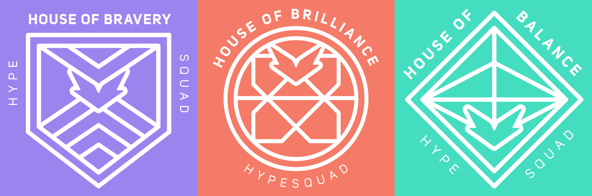

[![Issues][issues-shield]][issues-url]
[![MIT License][license-shield]][license-url]


<!-- PROJECT LOGO -->
<br />
<p align="center">
  <a href="https://github.com/othneildrew/Best-README-Template">
    
  </a>

  <h3 align="center">Hypesquad Badge Changer</h3>

  <p align="center">
    Discord Hypesquad Badge Changer
    <br />
</p>


<!-- TABLE OF CONTENTS -->
<details open="open">
  <summary>Table of Contents</summary>
  <ol>
    <li>
      <a href="#about-the-project">About The Project</a>
      <ul>
        <li><a href="#built-with">Built With</a></li>
      </ul>
    </li>
    <li>
      <a href="#getting-started">Getting Started</a>
      <ul>
        <li><a href="#prerequisites">Prerequisites</a></li>
      </ul>
    </li>
    <li><a href="#license">License</a></li>
    <li><a href="#contact">Contact</a></li>
  </ol>
</details>


<!-- ABOUT THE PROJECT -->
## About The Project

[![Product Name Screen Shot][product-screenshot]](https://discord.gg/rJV7Geh5xv)

A Hypesquad Badge Changer built in Python, for Discord!
You can select from the 3 badges!
> Hypesquad Bravery
> Hypesquad Brilliance
> Hypesquad Balance
### Built With

Please install all items below:

* [Python](https://www.python.org/)


<!-- GETTING STARTED -->

### Prerequisites
Please install all items below:

* Python
  ```sh
  https://www.python.org/
  ```


<!-- USAGE EXAMPLES -->
## Usage

Run the ```main.py``` file using ```python BadgeChanger.py``` and select an option


<!-- LICENSE -->
## License

Distributed under the MIT License. See `LICENSE` for more information.


<!-- CONTACT -->
## Contact

Discord - HoodTrips#0001

Discord Server - https://discord.gg/rJV7Geh5xv

Project Link: https://github.com/cTrappy/multi-tool


<!-- MARKDOWN LINKS & IMAGES -->
<!-- https://www.markdownguide.org/basic-syntax/#reference-style-links -->
[issues-shield]: https://img.shields.io/github/issues/othneildrew/Best-README-Template.svg?style=for-the-badge
[issues-url]: https://github.com/cTrappy/HypeSquad-Badge-Changer/issues
[license-shield]: https://img.shields.io/github/license/othneildrew/Best-README-Template.svg?style=for-the-badge
[license-url]: https://github.com/cTrappy/HypeSquad-Badge-Changer/blob/master/LICENSE.txt
[product-screenshot]: images/screenshot.png
